# CLOP: Contrastive Language-Omics Pre-training
## Team: Swiss-Androsace

## Project description

CLOP aims to provide a shared embedding for omics (DNA, RNA, protein) sequences and their functions which can be used to perform downstream analysis at high speed.

It is based on the CLIP architecture, which jointly trains an image transformer and a text transformer to project respectively pictures and captions into the same embedding space.

In CLOP, we use [Frequency Chaos Game Representation](https://www.sciencedirect.com/science/article/pii/S2001037021004736) to represent DNA sequences as a "fingerprint" image of fixed dimension.

This transformation allows us to work with sequences of very different lengths without limitations related to context window.

We directly fine-tune the CLIP transformers using these DNA images and function texts.

## Process

```mermaid

flowchart LR;

subgraph func[Function prediction]
    CLOPFUN[CLOP]
end;
subgraph fuzz[Fuzzy matching]
    CLOPFUZ[CLOP]
    MATCH["🧬🧬🧬"]
end;
subgraph zero[Zero shot classification];
    CLOPZERO[CLOP]
end;
  AFUN["🧬"] -->|embed| CLOPFUN;
  CLOPFUN -->|closest texts| FUN["Antibiotic resistance\nAntibiotic degradation"]
  AFUZ["🧬"] -->|embed| CLOPFUZ;
  CLOPFUZ -->|closest dna| MATCH;
  AZER["🧬"] -->|embed| CLOPZERO;
  DOL[🐬] -->|embed| CLOPZERO;
  BAC[🦠] -->|embed| CLOPZERO;
  CLOPZERO --> |similarity| DOLSIM["🐬, 🧬"];
  CLOPZERO --> |similarity| BACSIM["🦠, 🧬"];
  BACSIM --> MAX;
  DOLSIM --> MAX;
  MAX --> SELECT[🦠]

```

## Training data

For this demo, we restricted the training set to human transcript sequences (version GRCh38) and their functional annotations, available to download from https://www.ncbi.nlm.nih.gov/genome/guide/human/

We further subsampled 50,000 sequence-annotation pairs for the fine-tuning experiment.
